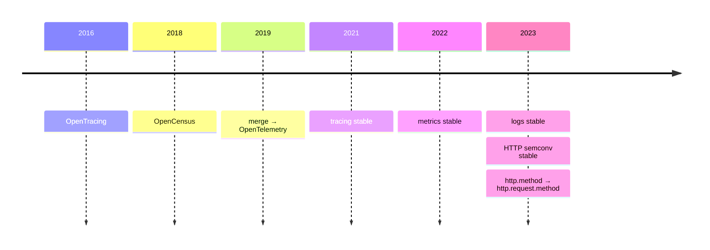

<!-- Holding slide. Nothing on screen while the hallway conversation starts. -->

🎙

<!--
OPENING — both on stage, lapel mics.
SIMON: "…no, but seriously, you do this every week…"
Stay on this slide until Thomas gives the textbook answer.
-->

---
layout: center
---

# "Never locked in again."

  

    
☸
Kubernetes
conformant distribution

  

  

    
🔭
OpenTelemetry
traces · metrics · logs

  

  

    
🚩
OpenFeature
vendor-neutral flags

  

everything CNCF · everything portable

<!--
THOMAS gives the textbook answer here.
SIMON: "That's exactly what I told them five years ago."
Hold through the reveal ("Don't you *maintain* OpenFeature?").
-->

---
layout: cover
class: text-center
---

# Your Open Source Standard Is Just Another Lock-In

Simon Schrottner · Thomas Schuetz

<!--
Title appears only after "Which is exactly why I'm allowed to say it."
THOMAS to audience: "I'm the defence. This is Simon, the prosecution and also one of the accused."
-->

---
layout: center
---

# "Never locked in again."

invoice

  
—

<!--
SIMON: "You said 'never locked in again'. Let's keep the bill for that. Every layer of that architecture — what it costs to leave, and what it costs to stay."
THOMAS: "Fine. Start with the one I'm most sure about."
-->

---
layout: center
---

  

☸
Kubernetes
conformant distribution

  

🔭
OpenTelemetry
traces · metrics · logs

  

🚩
OpenFeature
vendor-neutral flags

<!--
Topic switch — no words needed. THOMAS just says: "Kubernetes."
TODO: replace emoji with real logos (drop SVGs in public/logos/ and use ).
-->

---
layout: two-cols
---

☸ Kubernetes

# Moved in an afternoon

- Deployments, Services, ConfigMaps
- RBAC, Namespaces, NetworkPolicies
- Helm charts, CI pipelines
- `kubectl` — every single command

100+ certified distributions · one conformance suite · since 2017

::right::

# Took six weeks

<v-clicks>

- StorageClasses that don't exist
- LoadBalancer annotations nobody reads
- IAM → ServiceAccount binding (cloud-specific)
- Cluster autoscaler = the cloud's autoscaler in a hat
- Ingress class, cert issuer, DNS controller
- Managed control-plane defaults you never wrote down

</v-clicks>

<!--
THOMAS opens on the LEFT column: "That's not marketing, that's a test you can run."
SIMON clicks through the RIGHT column, one per item. Each is a real thing the customer hit.
"Conformance certifies the left column. Nobody lives in the left column."
THOMAS: the right column is smaller than the whole compute layer used to be.
-->

---
layout: center
---

# "Never locked in again."

invoice

  
Portable API. <b>Non-portable operations.</b>—

<!--
SIMON: "Conformance certifies the left column. Nobody lives in the left column."
THOMAS: the floor is where lock-in *used* to be. Cost moved up and got smaller.
SIMON: "…all CKA certified. Who did they get that from?" — THOMAS: "I may have sold them the training."
-->

---
layout: center
---

  

☸
Kubernetes
conformant distribution

  

🔭
OpenTelemetry
traces · metrics · logs

  

🚩
OpenFeature
vendor-neutral flags

<!--
SIMON: "So then we instrumented it."
TODO: replace emoji with real logos (drop SVGs in public/logos/ and use ).
-->

---
layout: center
---

🔭 OpenTelemetry

# How long consensus takes

<!--
TODO: verify dates against OTel spec release history before final.
SIMON: "So then we instrumented it." Customer instrumented 2021, re-instrumented twice, neither time because they wanted to.
-->

---
layout: fact
---

`http.method`

↓

`http.request.method`

every dashboard · every alert · every SLO

<!--
SIMON: "Sounds trivial. It touched everything that filtered on it."
"And who decided those names?"
THOMAS: "Vendors. In a public room, with public notes, and a PR you could have commented on."
-->

---
layout: two-cols
---

🔭 OpenTelemetry

# What you keep

- One SDK, any backend
- Traces, metrics, logs — one pipeline
- Semantic conventions everyone speaks
- Leave on Friday. Any Friday.

::right::

# What you lost leaving the agent

<v-clicks>

- Auto-discovery the vendor agent did for free
- [RUM / browser / mobile — thinner in OTel]
- [Profiling — years behind the vendor's]
- Vendor-side sampling & cost controls
- Two forced re-instrumentations in three years
- Dashboards rebuilt twice for a rename

</v-clicks>

<!--
TODO: check the bracketed items against the customer's actual vendor before final — keep only what is true.
SIMON clicks the RIGHT column. "Nobody tells you the migration *off* the proprietary agent has a feature list too."
THOMAS: the left column is permanent, the right column is one-time. "That's the deal."
-->

---
layout: center
---

# "Never locked in again."

invoice

  
Portable API. <b>Non-portable operations.</b>—

  
The standard moved. <b>Re-instrumented twice to keep up.</b>—

<!--
THOMAS: "The pain was one-time and the freedom is permanent. Once stable, stays stable."
SIMON: "Good deal. I'd take it. I'd just like the two migrations on the bill."
-->

---
layout: center
---

  

☸
Kubernetes
conformant distribution

  

🔭
OpenTelemetry
traces · metrics · logs

  

🚩
OpenFeature
vendor-neutral flags

<!--
THOMAS: "Flags were supposed to be the easy part."
TODO: replace emoji with real logos (drop SVGs in public/logos/ and use ).
-->

---
layout: two-cols
---

🚩 OpenFeature

# Portable

- The evaluation API
- Every SDK, every language
- Swap the provider: one line
- Hooks, context, the mental model

scoped small · shipped in months · learned from OTel

::right::

# Not portable

<v-clicks>

- The flag definitions themselves
- Targeting rules and segments
- Experiment & analytics data
- Audit history, approvals, workflows
- Provider-specific hooks you got used to
- The feature the customer wanted → "join the working group"

</v-clicks>

<!--
SIMON: "This is the round where I stop pretending to be neutral."
"We standardised the API. We did not standardise the *data*. Every flag, every rule, every segment is still in the vendor's format."
THOMAS: "You standardised the thing that touches every line of code. The rest is an export job." SIMON: "Show me the export."
-->

---
layout: center
---

# "Never locked in again."

invoice

  
Portable API. <b>Non-portable operations.</b>—

  
The standard moved. <b>Re-instrumented twice to keep up.</b>—

  
<b>Success slows the spec.</b>—

<!--
SIMON: "Join the working group." I'm a maintainer and I couldn't just *do* it for them.
THOMAS: "That's not failure. That's the thing becoming load-bearing."
SIMON: "I know. I'm the one who slowed it down. The complaint is what it *looked like* while it was fast."
-->

---
layout: center
---

🚩 OpenFeature

# Who paid the engineers?

  [ CNCF DevStats — OpenFeature contributions by company, over time ]

devstats.cncf.io · companies contributing · one colour dominates the early years

<!--
TODO: screenshot from devstats.cncf.io, OpenFeature, "Companies contributing" stacked chart.
SIMON: "Open on paper, one company's roadmap in practice. Not a conspiracy — just who paid the engineers. The bus factor was a parking factor."
"There are standards that never made that transition. Proprietary with extra steps."
THOMAS: "The door was real. Nobody can padlock it." SIMON: "If someone walks through." — "Hold that thought."
-->

---
layout: center
---

# "Never locked in again."

invoice

  
Portable API. <b>Non-portable operations.</b>—

  
The standard moved. <b>Re-instrumented twice to keep up.</b>—

  
<b>Success slows the spec.</b> One door. <b>One company behind it.</b>—

<!--
ROUND 4 starts here.
SIMON: "So the customer asked what it would cost to leave. All of it."
"Real, not zero, and anyone who told them it was zero was selling something."
THOMAS: "Now do the graveyard."
SIMON: hands-up moment — "who's migrated off something in the last year? Keep them up if it was an open standard."
-->

---
layout: two-cols
---

# Archived

- spec: still there
- code: still there
- data: readable by someone else

[ CNCF archived projects list ]

::right::

# Discontinued

- spec: never existed
- code: gone with the contract
- data export: <b>no</b>

[ discontinued proprietary products ]

<!--
TODO: fill both columns with real, safe examples.
THOMAS: "Which corpse is easier to exhume?"
SIMON: "The open one. Every time. But there's a row I haven't added yet."
-->

---
layout: center
---

# "Never locked in again."

invoice

  
Portable API. <b>Non-portable operations.</b>6 weeks · the platform team

  
The standard moved. <b>Re-instrumented twice to keep up.</b>2 migrations · everyone with a dashboard

  
<b>Success slows the spec.</b> One door. <b>One company behind it.</b>1 working group · 1 engineer, indefinitely

  
<b>Currency</b>knowledge

  

    
convertible what a span is · how a flag evaluates · what a Deployment does <b>spends at the next vendor, the next job</b>

    
non-convertible the console · the query language · the vendor's workflow <b>worthless the day the contract ends</b>

  

<!--
Click 1 — amounts appear. SIMON: "You've been reading this invoice without a currency column. Six weeks of the platform team. Two migrations for everyone who owns a dashboard. One engineer in a working group, indefinitely. Nothing on here is in euros."
Click 2 — currency stamp. SIMON: "The currency is knowledge. What your people had to learn, and would have to learn again. Nobody budgets for it. And somebody in this room sells it."
THOMAS: "Guilty. And I'll take that currency, because it's the best thing on the invoice."
Click 3 — split. THOMAS: "Two kinds. Convertible — what a span is, how a flag evaluates. That spends at the next vendor, the next job. Non-convertible — the console, the query language. Worthless the day the contract ends. Now price your proprietary stack. Same currency. All of it non-convertible."
-->

---
layout: center
---

Senior Platform Engineer — [Company]

Requirements

✓ Kubernetes

✓ OpenTelemetry

✓ Feature flag platforms (OpenFeature)

✗ [Vendor Product™]

<!--
TODO: use a real, anonymised job ad screenshot if possible.
THOMAS: "Knowledge locked into a vendor console dies the day the contract ends. Knowledge locked into a standard goes with the person."
"If you have to be locked into something — and you do — be locked into what your people can carry."
-->

---
layout: statement
---

Not *whether* you're locked in.

*To whom.*

<!--
THE TURN. Tone drops. Both step to centre.
SIMON concedes: the knowledge travels — bigger difference than the API.
THOMAS concedes: the cost never goes to zero, it moves somewhere nobody's looking. "I should say it in trainings."
-->

---
layout: center
---

<v-clicks>

**1.** Evaluate the governance, not just the spec.

**2.** Contribution is self-interest.

**3.** A standard nobody maintains is just slower lock-in.

</v-clicks>

Homework: pick one standard you depend on. Find out who controls its roadmap. <b>Not the logo. The chart.</b>

<!--
SIMON: 1 — "Pull up that DevStats chart before you adopt anything."
THOMAS: 2 — "That 'join the working group' answer Simon hated giving? It was the right answer."
SIMON: 3.
THOMAS: homework.
-->

---
layout: cover
class: text-center
---

# Your Open Source Standard Is Just Another Lock-In

Simon Schrottner · schrottner.at/talks

Thomas Schuetz · [link]

<!--
SIMON: "And if you don't like the answer —"
THOMAS: "— the door's open."
-->
